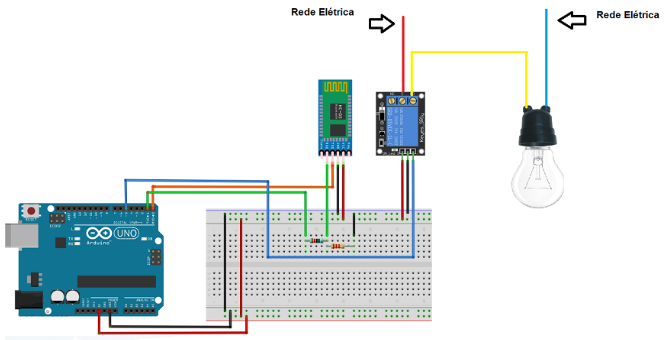

# ArduinoReleControll

A finalidade desse aplicativo é conectar-se com um dispositivo Bluetooth ligado a um arduino e enviar sinais para o mesmo. No caso desse projeto, montei um circuito para ligar e desligar lâmpadas com uso de um Arduino Uno e um módulo Bluetooth HC06 ligados a um relé, conforme a figura abaixo:

## O APP

O app conecta-se ao Bluetooth e envia comandos os quais são interpretados pelo Arduino e enviados para o relé. Estes comandos podem ser configuráveis. Previ o uso de um módulo com até 8 relés.

## Licença de uso

[MIT](https://choosealicense.com/licenses/mit/)